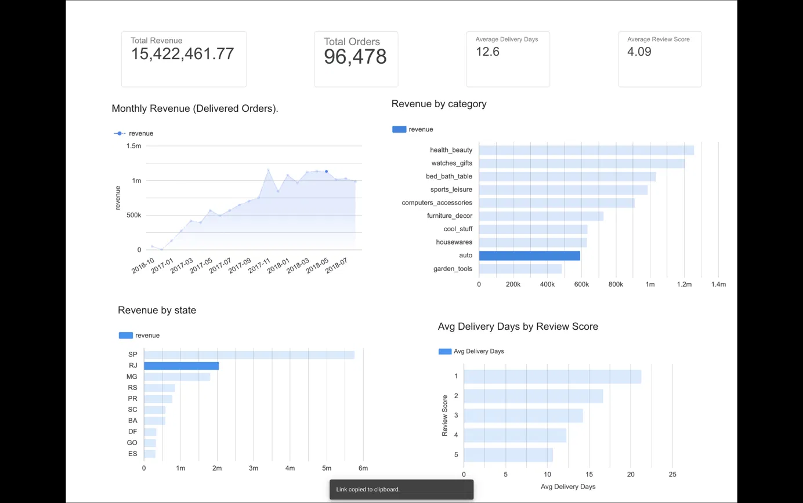

# Olist E-Commerce Sales Analysis

I analyzed 96K delivered orders from the Olist Brazilian E-Commerce dataset (2016-2018) using SQL and built a dashboard to show the results.

**Dashboard:** [https://datastudio.google.com/reporting/1553feb4-1019-4585-91a0-02f99d201d9d]

## What I found
- Orders with 1-star reviews took about 21 days to arrive. 5-star orders took about 11 days.
- São Paulo (SP) brings in the most revenue, far ahead of RJ and MG.
- Revenue grew through 2017, then stayed around 1M BRL per month in 2018.

## Numbers
- 96,478 delivered orders
- 15.4M BRL total revenue
- 12.6 days average delivery time
- 4.09 average review score

## Tools
SQLite, DB Browser for SQLite, Data Studio

## Files
- `sql/` - the SQL queries
- `dashboard/` - CSV exports and dashboard screenshot

## Data
[Olist dataset on Kaggle](https://www.kaggle.com/datasets/olistbr/brazilian-ecommerce)
